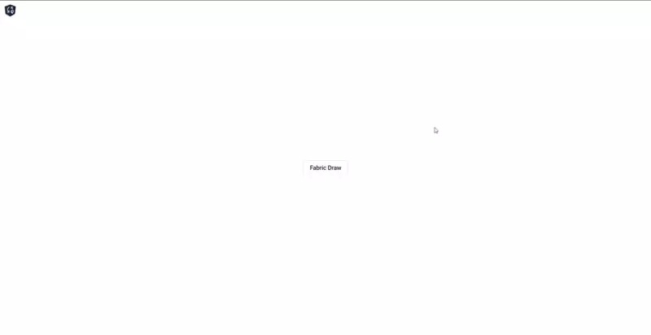

# EasyDraw

## Purpose

Quick record thought.

site: <https://easy-draw-a56ec.web.app/>

## Preview

## Dependency library

- Angular (<https://angular.io/>)
- rxjs (<https://rxjs.dev/>)
- typescript (<https://www.typescriptlang.org/>)
- angular material (<https://material.angular.io/>)
- tailwindcss (<https://tailwindcss.com/>)
- fabricjs (<https://github.com/fabricjs/fabric.js>)

### Inspired by

excalidraw (<https://excalidraw.com/>)

## Development server

Run `ng serve` for a dev server. Navigate to `http://localhost:4200/`. The app will automatically reload if you change any of the source files.

## Code scaffolding

Run `ng generate component component-name` to generate a new component. You can also use `ng generate directive|pipe|service|class|guard|interface|enum|module`.

## Build

Run `ng build` to build the project. The build artifacts will be stored in the `dist/` directory. Use the `--prod` flag for a production build.

## Running unit tests

Run `ng test` to execute the unit tests via [Karma](https://karma-runner.github.io).

## Running end-to-end tests

Run `ng e2e` to execute the end-to-end tests via a platform of your choice.

## Further help

To get more help on the Angular CLI use `ng help` or go check out the [Angular CLI Overview and Command Reference](https://angular.io/cli) page.
